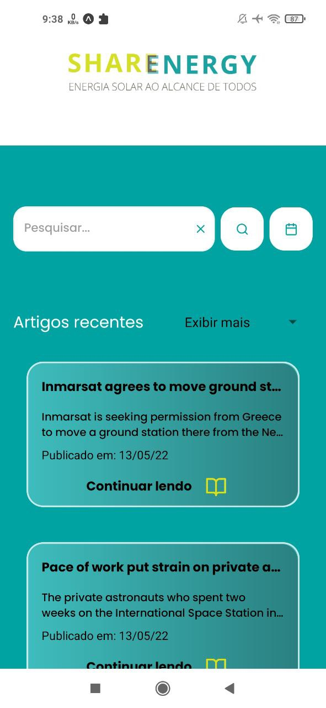

<h1 align="center">SHARENERGY NEWS</h1>

<p align="center">Aplicativo para leitura de artigos de várias entidades tais como Nasa, NASA Spaceflight e SpaceNews entre outros.</p>

<h4 align="center"> 
	 SHARENERGY NEWS 🚀 Finalizado
</h4>
<a target="_blank" href="https://www.figma.com/file/RNSTDvYW5wNkerWehMv9t8/SHARENERGY?node-id=0%3A1">
   Projeto no figma
</a>
<h1 style="display: flex; justify-content: space-evenly">
    
    
    
</h1>

### Pré-requisitos

Antes de começar, você vai precisar ter instalado em sua máquina as seguintes ferramentass:
[Expo](https://docs.expo.dev/get-started/installation/), [Git](https://git-scm.com), [Node.js](https://nodejs.org/en/).
E em seu smartphone [expoGO](https://expo.dev/client)

### 🎲 Rodando o App

```bash
# Clone o repositório

# Acesse a pasta do projeto no terminal/cmd
$ cd desafio-sharenergy-2022-01

# Instale as dependências
$ npm install
ou
$ yarn

# Execute a aplicação em modo de desenvolvimento
$ expo start

# O servidor inciará e exibira um QR code, escanei com seu smartphone usando o ExpoGo 
```
# Ou você pode baixar o SHARENERGY-NEWS App 
<a target="_blank" href="https://drive.google.com/file/d/1k5nxH7GTfAO3As2fufUC24dlvRiReDrJ/view?usp=sharing">
    Versão Android
</a>

### 🛠 Tecnologias

As seguintes ferramentas foram usadas na construção do projeto:

- [Expo](https://expo.io/)
- [Node.js](https://nodejs.org/en/)
- [React Native](https://reactnative.dev/)
- [TypeScript](https://www.typescriptlang.org/)

---

### Autor

<a target="_blank" href="https://github.com/TiagoSSGaspar?tab=repositories">
 
</a> 
<br />

Feito com ❤️ por Tiago S S Gaspar!

[](https://www.linkedin.com/in/tiago-sousa-silva-gaspar/)
